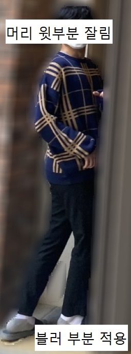
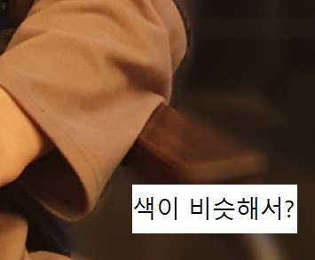
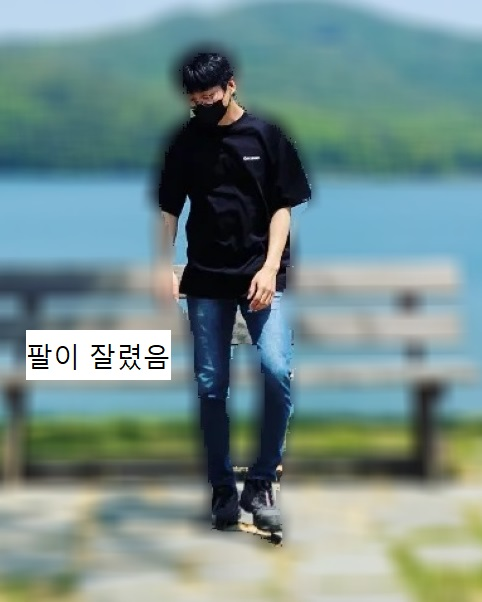

## Segmentation
 
portrait.ipynb : 아웃포커싱 적용 인물사진 
cat : 아웃포커싱 적용 고양이 사진 
catconcat : 배경합성 적용 고양이 사진 
 

## 완전하지 못한 Segmentation

1. 다리 사이 인식 못함, 머리 윗부분 잘림 

 
2. 옷 색과 비슷한 의자 인식 

 
3. 팔 색과 비슷한 의자 인식 

 
###요약
사람이라고 인식한 픽셀과 주변 사물의 픽셀이 비슷한 색의 정보를 담고 있으면 자세히 구분을 하지 못한다.(1,3) 
사람 신체 사이의 배경 부분을 자세히 구분해내지 못한다.(2) 

## Semantic Segmentation mask 보완
1. Two Stage Segmentation 기술 적용 
지금의 방법은 하나의 이미지에서 픽셀이 어떠한 객체에 속하느냐를 판단하고 분류하고 끝 
Two Stage Segmentation 기술을 적용한다면 
하나의 이미지에서 마스크된 부분을 따로 저장하고, 마스크된 부분만을 불러와서 다시 한번 마스킹 진행한다. 
전체사진에서 픽셀을 라벨링 하는것과 한번 필터를 거치고 난 후 따로 불러내어 다시 라벨링하는것에서 정확도 차이가 난다는 생각 
다리 사이나, 비슷한 색으로 인하여 구분하지 못하는 것을 해결할 수 있을거라 생각하는 방법 
실제로 Two Stage 진행을 통해 정확도를 높히는 사례를 발견 
(https://blog.doctor-cha.com/catch-up-with-segmentation-in-12-days, 얼굴에서 머리카락 구분)
(https://www.sciencedirect.com/science/article/pii/S2772375522000739, 옥수수잎 병변 구분)
생각해보니 이는 stride 파라미터를 조정하는 방법과 비슷한 방법론이 아닌가 생각해봄 
 

## 회고
보완이라 그래서 너무 크게 생각했던 것 같다. 고민하고 고민해서 작은 영역에서 할 수 있는 것을 찾아보니 
원하는 방향성인지는 모르겠지만 나름 간단하게 결론을 찾을 수 있었다. 
나중에 ~톤 할때도 거창하게 바꾸려 하지말고 간단한 것부터 차근차근 바꿔보면 좋은 효과가 나지 않을까 생각한다. 
하..할 수 있겠지.....? 

